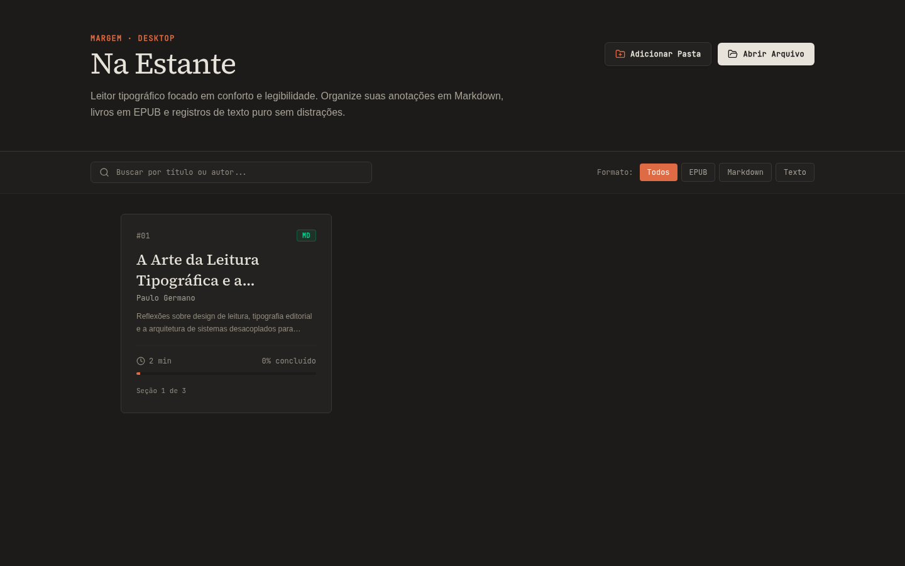
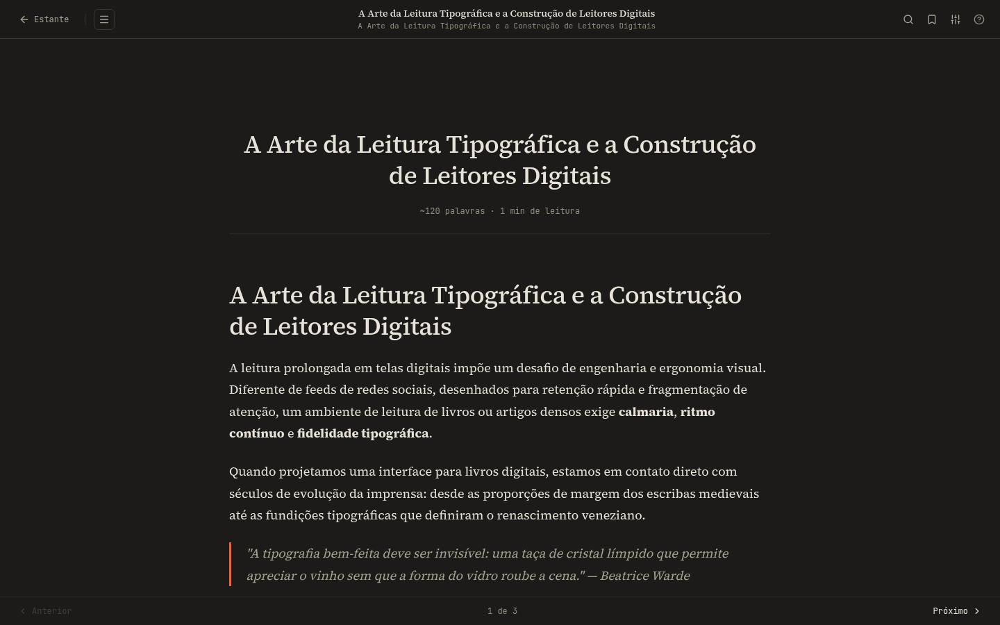
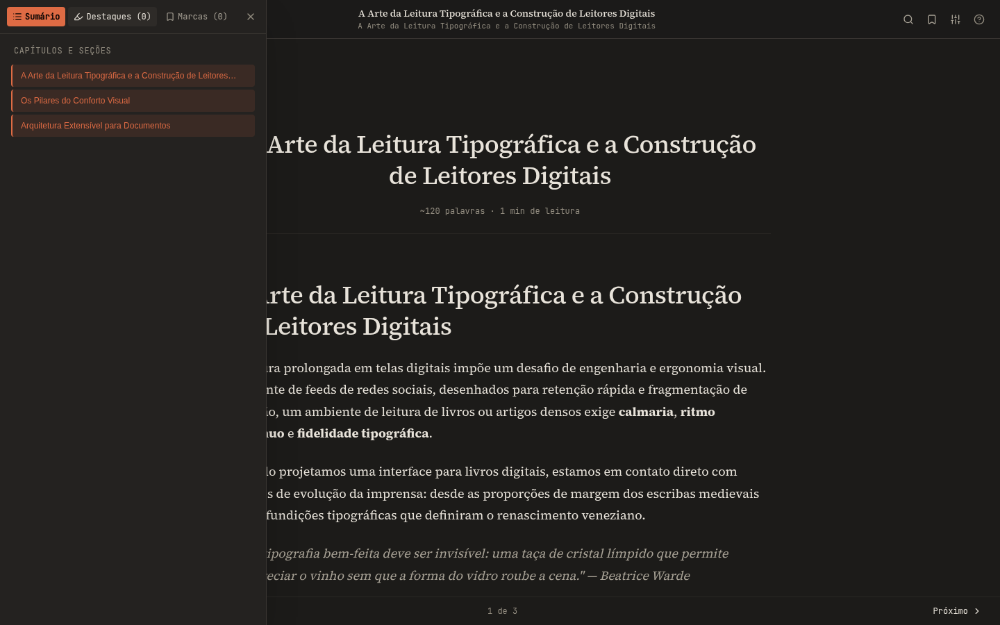
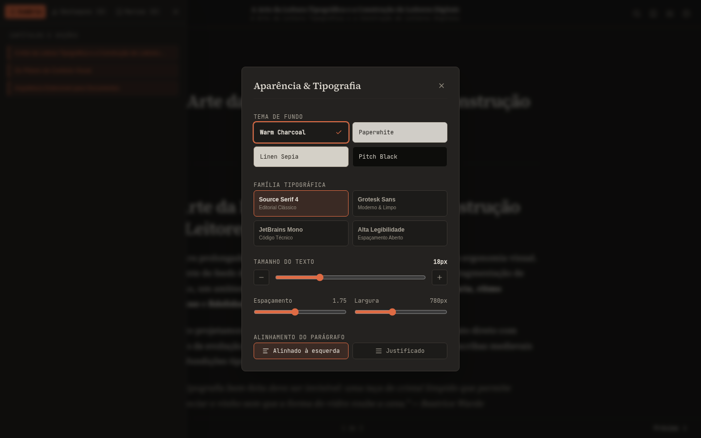
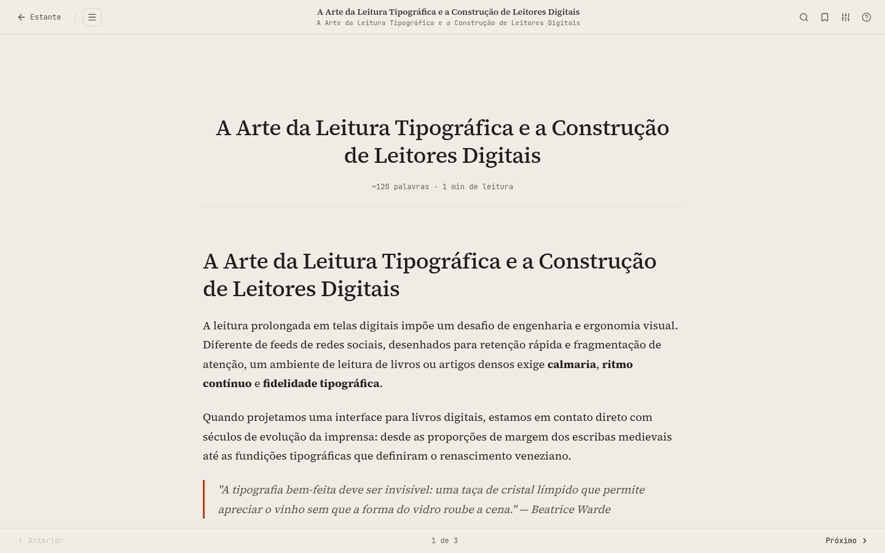

# Margem 📖

> Leitor desktop tipográfico para Linux (AppImage) — **Electron + React 18 + TypeScript + Tailwind CSS v4 + Vite**. Estética editorial calma inspirada no ecossistema **PauloGerm.dev**.



**MD · TXT · EPUB · PDF** · estante local · 4 temas de leitura · sumário + busca · marcadores e grifos · 100% offline.

---

## ✨ Destaques

- **Estante / Biblioteca** — cards com progresso, tempo estimado, contagem de palavras, filtros por formato/pasta e busca instantânea.
- **Importação em lote** — arquivos avulsos, drag & drop, pastas inteiras (recursivo) e livros compostos por múltiplos `.md`.
- **Leitor tipográfico** — Source Serif 4 + Newsreader + JetBrains Mono, medida 550–950px, `line-height` 1.4–2.2, alinhamento esquerda/justificado.
- **4 temas** — Warm Charcoal (padrão), Paperwhite, Linen Sepia, Pitch Black OLED.
- **Navegação estruturada** — TOC lateral, busca full-text com contexto, scrubber de progresso, anterior/próximo por capítulo.
- **Grifos e notas de margem** — 3 cores, notas ancoradas, exportação Markdown.
- **Persistência local** — IndexedDB (livros, posição, marcadores) + `localStorage` (preferências). Nada sai da máquina.
- **Higienização XSS** — todo HTML/Markdown/EPUB/PDF passa por DOMPurify com allowlist de embeds (ver `src/core/parsers/sanitize.ts`).

---

## 🖼️ Interface

Todas as capturas em **1440×900, escala device** (UI real, sem mock):

### Estante — Warm Charcoal

Busca, filtros `Todos / EPUB / Markdown / Texto`, cards `#01` com progresso e `Seção 1 de 3`.

### Leitor — Warm Charcoal

Coluna editorial 780px, serifa, citação com filete terracota `#DE6B44`, header/footer mínimos.

### Leitor — Sumário lateral

Painel `Sumário / Destaques / Marcas / Busca / Info`, salto direto por capítulo (`Ctrl+B`).

### Leitor — Aparência & Tipografia

Temas, 4 famílias tipográficas, tamanho/espaçamento/largura por slider, alinhamento (`Ctrl+,`).

### Leitor — Paperwhite (claro)

Fundo linho `#EFECE6`, texto `#1F1D1B`, mesmo ritmo vertical — ideal para dia / e-ink.

---

## 🚀 Como executar

Pré-requisitos: **Node.js 20+** ou **Bun 1.2+**.

```bash
# 1. Instalar
npm install

# 2. Dev web (Vite)
npm run dev
# → http://127.0.0.1:5173/

# 3. Dev desktop (Vite + Electron)
npm run dev:desktop

# 4. Build completo (tsc + vite + electron)
npm run build

# 5. AppImage Linux
npm run package:appimage
# → dist-package/Margem-1.0.0.AppImage

chmod +x "dist-package/Margem-1.0.0.AppImage"
./dist-package/Margem-1.0.0.AppImage
```

| Script | O que faz |
|---|---|
| `npm run dev` | Vite puro (prints acima foram gerados aqui) |
| `npm run dev:desktop` | `scripts/dev-desktop.mjs` — Vite + Electron lado a lado |
| `npm run build` | `tsc && vite build && scripts/build-electron.mjs` |
| `npm run package:appimage` | build + `electron-builder --linux AppImage` |
| `npm test` | 16 suítes Node (parsers, XSS, PDF, links, file-watcher, titlebar) |

---

## 📚 Formatos

| Formato | Extensões | Engine |
|---|---|---|
| Markdown | `.md`, `.markdown` | `MarkdownParser.ts` — frontmatter, headings, code, DOMPurify |
| Texto | `.txt` | `TextParser.ts` — detecção de `CAPÍTULO` |
| EPUB | `.epub` | `EpubParser.ts` — JSZip + OPF/Spine/NCX-NAV + imagens |
| PDF | `.pdf` | `PdfParser.ts` + `pdf*Engine.ts` — layout, tabelas, math, colunas |
| Pasta | diretório / `.book` | `FolderBookLoader.ts` — varredura recursiva, livro composto |

> Amostra embutida: `A Arte da Leitura Tipográfica` (`src/core/samples.ts`) — usada nos prints e no primeiro boot.

---

## ⌨️ Atalhos

| Tecla | Ação |
|---|---|
| `J` / `Espaço` | Rolar para baixo |
| `K` / `Shift+Espaço` | Rolar para cima |
| `[` / `]` | Capítulo anterior / próximo |
| `Ctrl+F` | Buscar no texto |
| `Ctrl+B` | Sumário lateral |
| `Ctrl+,` | Aparência & tipografia |
| `Ctrl+D` | Criar marcador |
| `?` | Guia de atalhos |
| `Esc` | Fechar modal / voltar à estante |

---

## 🎨 Temas

| Tema | Canvas | Surface | Texto | Accent |
|---|---|---|---|---|
| Warm Charcoal (dark) | `#1C1B19` | `#242220` | `#E8E3DA` | `#DE6B44` |
| Paperwhite (light) | `#EFECE6` | `#F6F3ED` | `#1F1D1B` | `#B34420` |
| Linen Sepia | `#F4EFE6` | `#EAE3D6` | `#2B2620` | `#9E4522` |
| Pitch Black OLED | `#0A0A09` | `#141412` | `#EDE8DE` | `#E06D44` |

Tokens em `src/styles/theme.css`. Troca via `data-theme` no `<html>` + `localStorage`.

---

## 🏗️ Arquitetura

Registry Pattern — novo formato = 1 classe, sem tocar o leitor:

```text
src/
├── core/types/          # Book, Section, TOC, Progress, Preferences
├── core/parsers/        # DocumentParser, ParserRegistry, Markdown/Text/Epub/Pdf
├── core/storage/db.ts   # IndexedDB + localStorage
├── components/Library/  # Bookshelf, BookCard, ImportDirectoryModal
├── components/Reader/   # ReaderView, Header/Footer, Sidebar, Modais, Highlights
├── components/Window/   # TitleBar (desktop)
└── styles/theme.css     # tokens + .reader-prose
```

```typescript
import { DocumentParser } from './DocumentParser';

export class PdfParser implements DocumentParser {
  readonly format = 'pdf';
  readonly extensions = ['pdf'];
  canParse(f: string) { return f.toLowerCase().endsWith('.pdf'); }
  async parse(buf: ArrayBuffer, filename: string) { /* … */ }
}

// registrar:
defaultParserRegistry.register(new PdfParser());
```

Entradas: `electron/main.ts`, `electron/preload.ts` (contextBridge `window.cadernoAPI`), `src/main.tsx`, `src/App.tsx`.

---

## 🔒 Segurança

- `MarkdownParser.ts` + `sanitize.ts`: DOMPurify + allowlist (YouTube/embeds), sem `eval`, sem `innerHTML` cru.
- `electron/preload.ts`: só expõe `window.cadernoAPI` via contextBridge; `main.ts` valida paths (`pathScope.ts`).
- Sem rede: parsers e storage 100% locais; PDFs com `pdf.worker.min.mjs` vendored em `public/`.

---

## 🧪 Verificação

```bash
npm run build
npm test
```

`npm test` roda 16 arquivos em `tests/` (`test-folder-books`, `test-xss-sanitize`, `test-pdf-*`, `test-link-engine`, `test-youtube-links`, `test-titlebar-engine`, `test-file-watcher`, etc.) — sem framework, `node --experimental-strip-types` + asserts.

---

## Licença e autoria

Desenvolvido de forma independente para **Paulo Germano**, com separação estrita do repositório do site pessoal.
